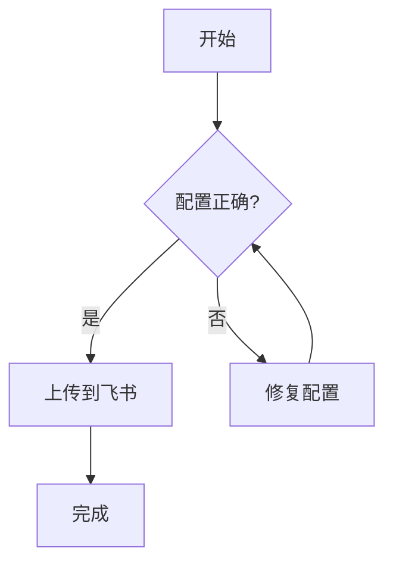

# 1. 中英文混排与留白样例

在Azure Portal中创建VM，并使用GitHub Actions进行部署。
本次发布预计3天完成，峰值带宽10Gbps，平均延迟30ms，成功率99.9 %，角度233 °，输出1080p。
字段包括store region（州）、store city(城市)和OpenAI API调用日志。
我们点击 "Analyze Data" 按钮后，再检查 '示例' 结果。
中文,English 之间需要桥接空格；This is a sentence,with punctuation issues.

这是第二段（与上段之间保留了额外空行）。

这是第三段（故意和上一段之间再多一行空行）。

## 1.1 文本样式

这是一段包含**黑体**、*斜体*和***黑体斜体*** 的正文。
也包含 ~~删除线~~ 以及 `inline code`。

## 1.2 六个本地附件（含 Animated GIF）

[Sample DOCX](./assets/sample.docx)

[Sample MP3](./assets/sample.mp3)

[Sample MP4](./assets/sample.mp4)

[Sample PPTX](./assets/sample.pptx)

[Sample XLSX](./assets/sample.xlsx)


## 1.3 远程图片下载（成功与失败）


图 1：可成功下载的远程图片（应被预处理为本地路径）。


图 2：不可下载的远程图片（应保留原 URL，并在 prepare 日志记录失败）。

## 1.4 第三方 Iframe 预览链接

[Bilibili](https://www.bilibili.com/video/BV14rzQB9EJj/?spm_id_from=333.1007.tianma.1-1-1.click&vd_source=0b29fdebfb6dec5d2359ce555c50e310)

[Douyin](https://www.douyin.com/video/7059202443845864734)

[Youku](https://v.youku.com/v_show/id_XMTY1MjYwODYzNg==.html?spm=a2h0j.11185381.listitem_page1.5!15~A&&s=9a35f8960f3c11e5a080)

[Figma](https://www.figma.com/file/LKQ4FJ4bTnCSjedbRpk931/Sample-File)

[CodePen](https://codepen.io/Rong-Shen/pen/YPWodaB)

[Feishu Wenjuan](https://wenjuan.feishu.cn/m?t=sVOKVVz7rwpi-ay5n)

## 1.5 yt-dlp 视频下载链接（独立行）

### Youtube video

https://www.youtube.com/watch?v=e97aedSCDTA

### Youtube playlist

https://www.youtube.com/watch?v=e97aedSCDTA&list=PLZI7-i34CgELEAqlshyNRCFtSHXPTin-9

### X video

https://x.com/i/status/2024415812363440151

# 2. 多层级标题示例

## 2.1 三级标题示例

### 2.1.1 四级标题示例

#### 2.1.1.1 五级标题示例

这一节用于验证不同层级 heading 的转换。

# 3. 列表示例

## 3.1 无序列表

- 在Azure中准备3台VM
- 配置VPC与子网
- 启动监控并校验30ms延迟目标

## 3.2 有序列表

1. 创建资源组
2. 部署服务镜像
3. 执行回归测试
4. 发布并观察指标

# 4. 引用示例

> 我们将在Sprint 3完成迁移，并在24小时内回滚预案演练。
> This is an English sentence, so it keeps English punctuation.

# 5. Markdown 表格示例（列宽与对齐）

## 5.1 宽列自适应 + 数值列右对齐

| 模块        | 详细说明（用于拉伸文本列，验证列宽自适应）                                                     | 月成本        | 增长率 | 存储容量 | 备注   |
| ----------- | ---------------------------------------------------------------------------------------------- | ------------- | ------ | -------- | ------ |
| API Gateway | 负责入口流量治理、限流、鉴权、灰度发布与多区域故障切换，依赖统一网关策略中心进行动态规则下发。 | CNY 12,340.50 | 30%    | 30gb     | 稳定   |
| Worker Pool | 执行异步任务队列，包含重试、幂等控制和死信队列回放；峰值时会根据任务密度自动扩容并回收。       | $8,920        | 12.5 % | 1.5TB    | N/A    |
| Scheduler   | 负责周期任务编排与跨时区调度，涉及节假日策略、优先级抢占、依赖拓扑排序。                       | USD -300      | 0%     | 30B      | inf    |
| Data Sync   | 跨地域增量同步与校验，需处理脏数据修复、断点续传和链路抖动。                                   | RMB 3,000     | n/a    | 12斤     | 观察中 |

## 5.2 多表格混合场景（短表）

| 指标         | 今日   | 昨日   | 环比   | 权重 |
| ------------ | ------ | ------ | ------ | ---- |
| 错误数       | 1,024  | 980    | 4.49%  | 30%  |
| P95 延迟(ms) | 29.8   | 31.2   | -4.49% | 40%  |
| 成本(USD)    | $2,000 | $2,200 | -9.09% | 20%  |
| 异常数据     | na     | N/A    | inf    | 10%  |

## 5.3 表格内块元素（基础识别）

| 类型                   | 表格内内容（单独一项，预期可识别为块）                                     | 引用说明                                                                           |
| ---------------------- | -------------------------------------------------------------------------- | ---------------------------------------------------------------------------------- |
| 小图（原始宽度 < 200） |                                                  | [普通链接应按文本宽度计算](https://example.com/docs)                               |
| 大图（原始宽度 > 200） |                                        | [Figma iframe 链接](https://www.figma.com/file/LKQ4FJ4bTnCSjedbRpk931/Sample-File) |
| 视频附件（mp4）        | [Demo Video](./assets/sample.mp4)                      | https://example.com/raw-url                                                        |
| 音频附件（mp3）        | [Demo Audio](./assets/sample.mp3)                      | [普通链接](https://example.com/audio-doc)                                          |
| iframe（Bilibili）     | [Bilibili](https://www.bilibili.com/video/BV1GJ411x7h7)                    | 用于验证 iframe provider 识别                                                      |
| iframe（Figma）        | [Figma Raw](https://www.figma.com/file/LKQ4FJ4bTnCSjedbRpk931/Sample-File) | 用于验证单独链接转 iframe                                                          |

## 5.4 表格内复合内容（混排与边界）

| 场景                      | 表格内内容（复合形式）                                                                                                           | 预期行为                                         |
| ------------------------- | -------------------------------------------------------------------------------------------------------------------------------- | ------------------------------------------------ |
| 可识别链接 + 前缀文本     | Figma 原链接：[Figma](https://www.figma.com/file/LKQ4FJ4bTnCSjedbRpk931/Sample-File)                                             | 非“单独一项”，按普通文本链接处理，不转 iframe 块 |
| 多个可识别链接同格        | [Figma](https://www.figma.com/file/LKQ4FJ4bTnCSjedbRpk931/Sample-File) + [Bilibili](https://www.bilibili.com/video/BV1GJ411x7h7) | 同格多链接，按文本处理，不生成块                 |
| 可识别 + 不可识别链接混合 | [Figma](https://www.figma.com/file/LKQ4FJ4bTnCSjedbRpk931/Sample-File) 与 [Docs](https://example.com/docs/alpha?from=table)      | 按文本宽度参与列宽计算                           |
| 不可识别链接（单独）      | [Project Docs](https://example.com/docs/alpha?from=table)                                                                        | 作为普通链接文本，不转 iframe/file/image         |
| 长文本 + 图片（同单元格） | 跨地域增量同步与校验，需处理脏数据修复、断点续传和链路抖动。<br><br>                                   | 混排场景：同一格既有长文本又有图片               |
| 裸 URL + 文本             | 参考地址 https://x.com/i/status/2024415812363440151 （说明）                                                                     | 含普通文本，整体按文本处理                       |
| 附件链接 + 说明文字       | 录像文件：[Demo Video](./assets/sample.mp4)（仅回放）                                                        | 非“单独一项”，按文本链接处理                     |
| 长文本 + 不可识别裸链接   | 该列用于拉伸宽度并混入 URL：https://example.com/very/long/path/for/width/measurement?x=1&y=2                                     | 按纯文本测宽（含链接字符）                       |

# 6. Markdown Todo 示例

- [ ] 对齐并确认成本列（货币）右对齐效果
- [ ] 对齐并确认容量列（带单位）右对齐效果
- [ ] 对齐并确认百分比列右对齐效果
- [x] 已验证表头行居中
- [x] 已验证 `N/A`、`na`、`inf` 不破坏数字列判断

# 7. 代码块示例（含 Mermaid）

## 7.1 Mermaid 文本绘图（默认转 block_type=40）



## 7.2 常规代码块（4种语言）

```bash
#!/usr/bin/env bash
set -euo pipefail
npm ci
npm run build
npm run test
```

```javascript
const deployRegion = 'eastus2';
const vmCount = 3;
console.log(`Deploying ${vmCount} VM(s) to ${deployRegion}...`);
```

```python
def calc_latency(samples):
    return sum(samples) / len(samples)

print(calc_latency([29.4, 30.2, 31.1]))
```

```sql
SELECT service_name, p95_latency_ms
FROM service_metrics
WHERE env = 'prod'
ORDER BY p95_latency_ms ASC;
```

# 8. KaTeX 公式示例

由质能方程 $(1)$ 可知，质量和能量可以相互转化。

$$
E = mc^2 \tag{1}
$$

将式 $(1)$ 代入式 $(2)$，得到……

$$
\hat{H}\psi = i\hbar\frac{\partial \psi}{\partial t} \tag{2}
$$

联立 $(1)$ 和 $(2)$ 可推导出……

# 9. 结语

如果文档在飞书中可完整显示标题、正文样式、六个 sample 附件（含 office 预览与 animated gif）、远程图片下载（含失败回退）、yt-dlp 拉取的视频附件、iframe 预览、代码块、Mermaid 文本绘图、列表、引用、todo、katex 和复杂表格（列宽/对齐），则说明 ex:comp 综合用例通过。
