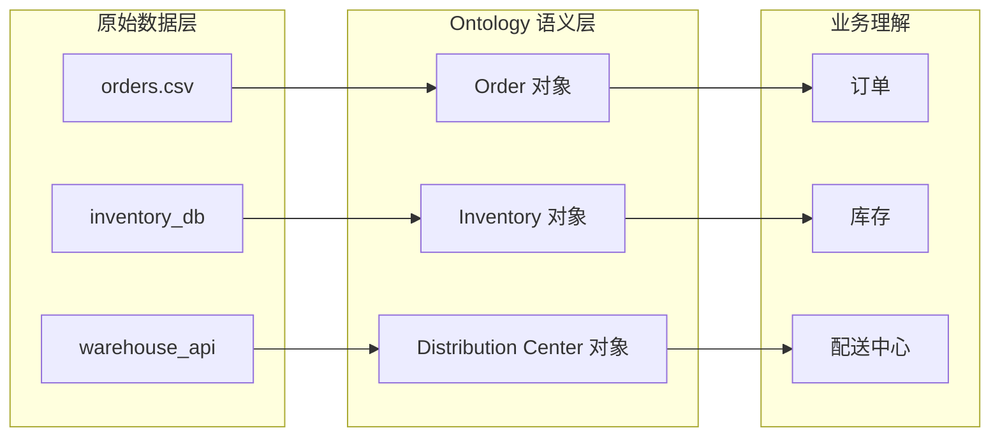

# Mermaid Test

```mermaid
flowchart LR
    subgraph RawData["原始数据层"]
        D1["orders.csv"]
        D2["inventory_db"]
        D3["warehouse_api"]
    end

    subgraph Ontology["Ontology 语义层"]
        O1["Order 对象"]
        O2["Inventory 对象"]
        O3["Distribution Center 对象"]
    end

    subgraph Business["业务理解"]
        B1["订单"]
        B2["库存"]
        B3["配送中心"]
    end

    D1 --> O1 --> B1
    D2 --> O2 --> B2
    D3 --> O3 --> B3
```
